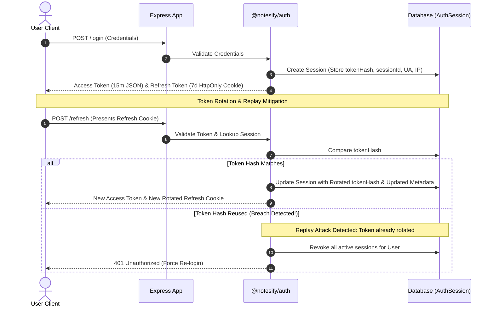

# @notesify/auth

A highly secure, decoupled, and event-driven authentication engine for Express and Mongoose applications. Built to handle session lifecycles, device auditing, and token rotation with robust replay-attack mitigation.

---

## Key Features

- 🔐 **Token-based Authentication**: Short-lived JWT access tokens paired with secure, HttpOnly refresh token cookies.
- 🔄 **Refresh Token Rotation (RTR)**: Automatically invalidates used refresh tokens and rotates them on every request to mitigate token theft.
- 🚨 **Breach / Replay Detection**: Detects refresh token reuse and immediately invalidates all active sessions for the compromised user.
- 📱 **Built-in Session & Device Audit**: Tracks client device, OS, browser, IP, and activity timestamps per session out of the box.
- 🔌 **Storage Decoupling**: Database interactions are abstracted using a `StorageAdapter`. Easily map your existing User schema without changing field names.
- 📬 **Event-Driven Lifecycles**: Completely email/SMS provider-agnostic. Register event hooks to send emails or run custom pipelines.
- ⚙️ **Configurable Feature Flags**: Toggle email verification, password reset, and token rotation dynamically.

---

## Architecture Flow



---

## Installation & Local Integration

Since this package is in local development, you can link it directly to your Express projects:

### 1. Register the package locally
Run this command inside the root of this authentication package folder:
```bash
npm link
```

### 2. Connect it to your Express app
Run this command inside the root of your target Express application folder:
```bash
npm link @notesify/auth
```

---

## Environment Configuration

Configure your environment variables:

```env
# JWT Configurations
ACCESS_SECRET=your_super_secret_access_key
REFRESH_SECRET=your_super_secret_refresh_key
ACCESS_EXPIRE=15m
REFRESH_EXPIRE=7d

# URL Configurations
FRONTEND_URL=http://localhost:3000
```

---

## Quick Start

### 1. Initialize Auth Setup
Import the core library and set up the Mongoose adapter in your app entrypoint:

```javascript
import express from "express";
import cookieParser from "cookie-parser";
import { createAuth, MongooseStorageAdapter } from "@notesify/auth";

import User from "./models/User.js";
import AuthSession from "./models/AuthSession.js"; // Created by package or custom schema

const app = express();
app.use(express.json());
app.use(cookieParser());

// Initialize the Mongoose Storage Adapter with Custom Field Mapping
const adapter = new MongooseStorageAdapter({
    userModel: User,
    sessionModel: AuthSession,
    fields: {
        email: "email",                  // Maps abstract fields to your actual schema fields
        password: "passwordHash",
        isVerified: "isVerified",
        verificationToken: "emailVerifyToken",
        verificationTokenExpiry: "verifyTokenExpiresAt",
        forgotPasswordToken: "passwordResetToken",
        forgotPasswordExpiry: "passwordResetExpiresAt"
    }
});

const auth = createAuth({
    adapter,
    accessSecret: process.env.ACCESS_SECRET,
    refreshSecret: process.env.REFRESH_SECRET,
    accessExpiry: "15m",
    refreshExpiry: "7d",
    cookie: {
        secure: process.env.NODE_ENV === "production",
        sameSite: "lax"
    },
    features: {
        emailVerification: true,
        forgotPassword: true,
        refreshRotation: true,
        multiSession: true
    },
    events: {
        onVerifyEmail: async ({ user, verificationUrl }) => {
            // Trigger email dispatch (Nodemailer, SendGrid, Resend, etc.)
            console.log(`Verification link: ${verificationUrl}`);
        },
        onForgotPassword: async ({ user, resetUrl }) => {
            // Trigger password reset email dispatch
            console.log(`Password reset link: ${resetUrl}`);
        }
    }
});

// Mount routes
app.use("/api/auth", auth.router);

// Protect other endpoints
app.get("/api/dashboard", auth.authMiddleware, (req, res) => {
    res.json({ message: `Hello, ${req.user.name}!`, currentSessionId: req.sessionId });
});
```

---

## Built-in Device & Session Management

The library provides built-in endpoints for device auditing and session control. Once routes are mounted (e.g., under `/api/auth`), these routes become available automatically for authenticated requests:

### 1. `GET /sessions`
Returns a list of all active sessions for the logged-in user with parsed User-Agent strings.
* **Response**:
```json
{
  "success": true,
  "sessions": [
    {
      "id": "6856af09-f808-47c5-ba59-194452ca13ec",
      "device": "Desktop",
      "os": "macOS",
      "browser": "Safari",
      "ip": "127.0.0.1",
      "lastUsedAt": "2026-06-23T16:22:50.000Z",
      "current": true
    },
    {
      "id": "f2fa6c78-f808-47c5-ba59-194452ca13ec",
      "device": "Mobile",
      "os": "iOS",
      "browser": "Chrome",
      "ip": "192.168.1.10",
      "lastUsedAt": "2026-06-23T15:10:00.000Z",
      "current": false
    }
  ]
}
```

### 2. `DELETE /sessions/:id`
Terminates a specific session, logging out that device.

### 3. `DELETE /sessions`
Terminates all sessions for the user *except* the currently active one (Logout other devices).

---

## Security Guarantees

- **Hashed Passwords**: Auto-hashed on register via `bcrypt` (10 rounds).
- **Hashed Session Keys**: Refresh tokens are stored as SHA-256 hashes in the database to prevent plain-text hijacking on db compromise.
- **Timing-Safe Password Checks**: Constant-time string matching prevents database and password timing attacks.
- **HttpOnly Cookies**: Prevents client-side scripts (XSS) from reading the refresh token.
- **SameSite Protection**: Configurable SameSite cookie policy prevents Cross-Site Request Forgery (CSRF).
- **Automated Replay Protection**: Refresh Token Rotation tracks old tokens. If an old token is resubmitted, the library assumes a theft breach and invalidates *all* sessions for that user instantly.
- **Auto-Cleanup (TTL)**: Sessions automatically expire and are purged by MongoDB's background TTL index matching the `expiresAt` parameter.

---

## Verification & Tests

To run the integration test suite:

```bash
node test.js
```

### Coverage Checklist
- [x] Register
- [x] Login
- [x] Invalid password rejection
- [x] Email verification flow
- [x] Refresh token rotation (RTR)
- [x] Replay / Reuse attack detection & auto-revocation
- [x] Logout (Session termination)
- [x] Specific device session revocation
- [x] Logout other sessions (Logout everywhere else)
- [x] Middleware route protection (Bearer Access Token check & cookie fallbacks)
